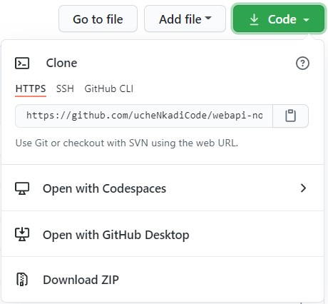
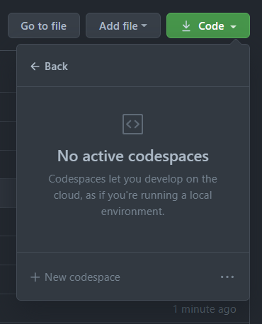
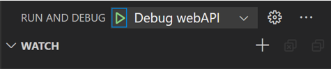
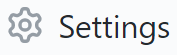
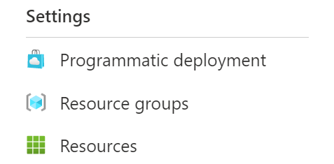
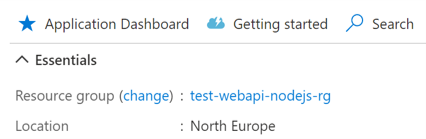

# Quickstart

In this guide you will learn how to:

- Set up your repo and getting up and running in [GitHub Codespaces](https://code.visualstudio.com/docs/remote/codespaces).
- Connect the repo to Azure and deploy your application.
- View the live app's logs and metrics in the Azure Portal.

## Open your repo in Codespaces

Codespaces is a Github feature that enables you to run a full development environment in the cloud. It uses VS Code in the browser to host dev containers. The template comes complete with all the necessary tools and extensions for developing your application.

**Note:** You can also run the template locally, by cloning the repo.

These steps will help you create your own repository and open it in Codespaces:

1. Click the green button **Use this template** to create a copy of this repository.
1. Change the **Owner** to your GitHub account and enter a unique repository name.
1. Click **Create repository from template**.
1. Ensure you are in the newly create repository when continuing this quickstart.
1. Click on the green **Code** button and select **Open with Codespaces**.

    

    **Note:** This feature is in private preview, so if you do not see the option, learn how to [run your app in a dev container](/docs/how-to-guides.md#use-vs-code-development-container).

1. Create a new Codespace if one does not already exist.
    
    

1. The repo will open inside of VS Code in your browser.

## Run the app

1. Once Codespaces is open, hit <kbd>F5</kbd> to start the application. This will run the `Debug webAPI` launch task.

    

1. When VS Code prompts you, select **Open in Browser** in the lower right. This will take you to the [Swagger](https://swagger.io/docs/specification/about/) page exposed by the Web API where you can test the different routes.

    **Note** If your browser is blocking the pop-up, you'll have to restart the debug task with <kbd>Ctrl+Shift+F5</kbd>.

## Deploy the app

The template sets up your deployment process by implementing GitHub workflows to deploy your application to Azure. More information on deployment can be found in the [conceptual documentation](/docs/concepts.md#build-and-deployment). Now that your app is running in Codespaces, let's get it hosted in Azure!

### Connect your repository to Azure

GitHub workflows will use a Service Principal to authenticate to Azure and deploy the application to your subscription.

These steps will help you create a Service Principal and hook it up to your GitHub repo.

1. Create a [new Azure subscription](https://azure.microsoft.com/free/) or use an existing one.
1. Create a new terminal (`` Ctrl + Shift + ` ``) in Codespaces.
1. Log into your Azure account with `az login` and follow the prompts.
1. List your available subscriptions with `az account list` and set the default by name or ID with `az account set -s <subName or subID>`
1. Enter `az account show` to verify the correct subscription is selected.
1. Enter `az ad sp create-for-rbac --sdk-auth --role Contributor --scopes /subscriptions/{subscriptionId}` to create a service principal, replacing `subscriptionId` with your own subscription ID.

    > **Note:** This Service Principal will have subscription-wide contributor rights. This gives access to all resources in the subscription.

1. Copy the full JSON output including `{}`.
1. On GitHub.com, navigate to your repository and go to **Settings > Secrets > New repository secret**. Click [here](https://docs.github.com/actions/reference/encrypted-secrets#creating-encrypted-secrets-for-a-repository) for more information on creating a GitHub secret.

    

1. Add a new secret named `AZURE_CREDENTIALS` and paste the full JSON output.

### Start the build workflow

The [build and release workflow](../.github/workflows/build_release.yaml) will build, test, and deploy the application using the configuration in [`config.yaml`](../deploy/config.yaml).

These steps will help you start the build workflow manually.

1. From GitHub in the browser, select the **Actions** tab in your repo.
1. Select the **Build and Release** workflow.
1. Open the **Run workflow** dropdown and select **Run workflow**.

## View your live app

Once your app is successfully deployed, your Web API is running in an [App Service](https://azure.microsoft.com/services/app-service/) and now communicates with an instance of [Azure SQL Database](https://azure.microsoft.com/services/sql-database/). Your app is live!

These steps will help you open a running instance of your application in the cloud.

1. Once the deploy workflow is successfully completed, go to the [Azure Portal](https://portal.azure.com) and login.
1. Click the top-middle search bar and search for **Subscriptions** under the **Services** category.
1. Select the default subscription you chose during [Connect your repository to Azure](#connect-your-repository-to-azure).
1. On the left hand side navigation, scroll down and select **Resource groups**.

    

1. Select the resource group that contains `rg-{gitHub repository name}`. This should be the resource group created by the template deployment.
1. Select the App Service resource.
1. In the **Essentials** section, click the URL to open your deployed application.

## Manage and monitor your app

We've set up an [Application Insights](https://docs.microsoft.com/azure/azure-monitor/app/app-insights-overview) resource with your deployment, so you can monitor and view the logs of your app in real time.

These steps will help you view the health, logs, and metrics of your app.

1. From the [Azure Portal](https://portal.azure.com), navigate to your subscription and select the resource group that begins with `test` (directions in the previous section).
1. Select the Application Insights resource that contains `insights`.
1. From the **Overview** tab, observe the key diagnostics of your cloud application.
1. Click on **Application Dashboard** to get a comprehensive view of your app's performance and reliability.

    

## Next steps

Great job, you did it! Now that your application is up and running, you may want to:

- [Learn more about the template concepts](concepts.md)
- [Check out more How-Tos](how-to-guides.md)

## Contact us

- Did you find a bug or think of an idea to improve this template? [Submit an issue](https://aka.ms/webapi-plus-database-dotnet-issues). **We love your feedback!**
